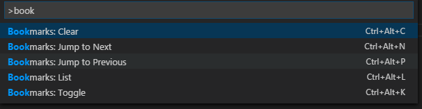
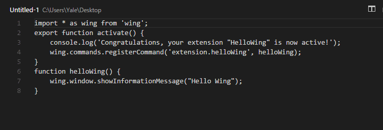

# 功能

添加书签

# 使用方式

* **Bookmarks: Toggle** 添加或删除书签 (ctrl+alt+k)
* **Bookmarks: Jump to Next** 移动到下一书签 (ctrl+alt+n)
* **Bookmarks: Jump to Previous**  移动到上一书签 (ctrl+alt+p)
* **Bookmarks: List** 列出所有书签 (ctrl+alt+l)
* **Bookmarks: Clear** 删除所有书签 (ctrl+alt+c)

[MIT](LICENSE.md)

Thanks for [alefragnani](https://github.com/alefragnani/vscode-bookmarks)
